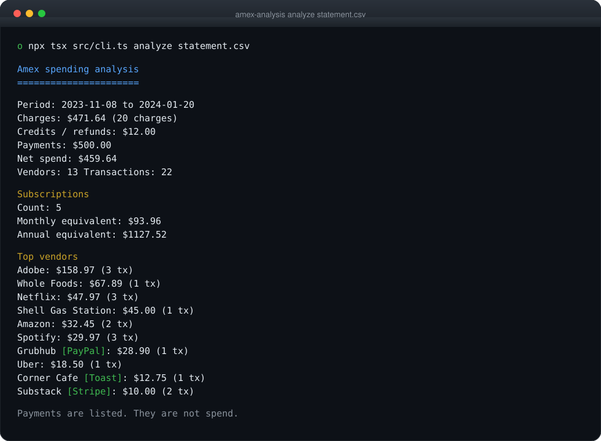
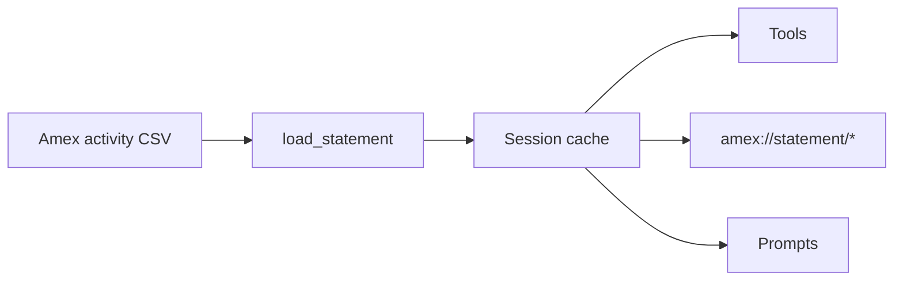

<p align="center">
  
</p>

<h1 align="center">Amex Analysis MCP</h1>

<p align="center">
  <strong>Local American Express statement analysis</strong> for Claude Desktop and the terminal.
</p>

<p align="center">
  
  
  
  
  
  
</p>

<p align="center">
  <a href="#install">Install</a> ·
  <a href="#claude-desktop">Claude Desktop</a> ·
  <a href="#cli">CLI</a> ·
  <a href="#tools">Tools</a> ·
  <a href="#csv-format">CSV</a> ·
  <a href="CHEATSHEET.md">Cheatsheet</a> ·
  <a href="ENHANCED_SERVER_GUIDE.md">Enhanced catalog</a> ·
  <a href="CHANGELOG.md">Changelog</a>
</p>

<p align="center">
  
</p>

Point it at an Amex activity CSV. It unmasks processor descriptors, splits **charges** from **credits** and **payments**, and answers follow-up questions from the statement already in memory.

There is no HTTP server and no database. The file you name is the only data it sees.

| Statement line | Vendor | Processor |
|----------------|--------|-----------|
| `PAYPAL *GRUBHUB` | Grubhub | PayPal |
| `SQ *BLUE BOTTLE` | Blue Bottle | Square |
| `STRIPE: SUBSTACK INC` | Substack | Stripe |
| `TST* CORNER CAFE` | Corner Cafe | Toast |

## Features

**Vendor unmasking.** PayPal, Square, Stripe, Toast, Venmo, Cash App, Zelle, Clover, Shop Pay, Klarna, Afterpay, Apple Pay, and Google Pay. Specific merchant maps only — `COFFEE` does not become “Local Coffee Shop.”

**Honest totals.** Card payments (`ONLINE PAYMENT THANK YOU`, autopay, and similar) are never counted as spend. Credits stay credits. Sign convention is detected from the file, because Amex exports come both ways.

**One load per session.** Call `load_statement` once. Later tools omit `csvPath` and reuse the parsed file until it changes on disk.

**Subscriptions.** Known services plus recurring amount and interval. “Unused” is measured from the **statement end date**, not today’s clock.

**Two surfaces.** Ask Claude, or run `analyze` / `unmask` in a terminal. Excel, CSV, and JSON export from both.

**Not in scope.** It does not log into American Express, fetch receipts, read Chase or Citi files, or train a model on your data.

## Install

Requires [Node.js](https://nodejs.org/) 18.18 or newer and an Amex activity CSV with `Date`, `Description`, and `Amount`.

```bash
git clone https://github.com/ogprotege/amex-anaylsis-mcp.git
cd amex-anaylsis-mcp
npm install
npm test
npm run build
```

`npm test` and `npm run test-unmasking` generate their own sample CSV. You do not need to put a personal statement in the repo.

## Claude Desktop

Add the server, then restart Claude Desktop.

**macOS:** `~/Library/Application Support/Claude/claude_desktop_config.json`  
**Windows:** `%APPDATA%\Claude\claude_desktop_config.json`  
**Linux:** `~/.config/Claude/claude_desktop_config.json`

```json
{
  "mcpServers": {
    "amex-analysis": {
      "command": "node",
      "args": ["/absolute/path/to/dist/amex-mcp-server.js"]
    }
  }
}
```

Then:

```
Load ~/Downloads/activity.csv
What are my subscriptions this period?
Unmask the PayPal and Square charges
Search Uber over $20
```

After `load_statement`, later tools can omit `csvPath`. You can also read `amex://statement/summary` or use the `review_subscriptions` prompt.

<details>
<summary><strong>Full catalog</strong> (enhanced server)</summary>

```json
{
  "mcpServers": {
    "amex-analysis-enhanced": {
      "command": "node",
      "args": ["/absolute/path/to/dist/amex-mcp-server-enhanced.js"]
    }
  }
}
```

Both can be registered at once. Dev without building: `npm run dev` (standard) or `npm run dev:enhanced`. Details: [ENHANCED_SERVER_GUIDE.md](ENHANCED_SERVER_GUIDE.md).

</details>

## CLI

```bash
npx tsx src/cli.ts --help
npx tsx src/cli.ts unmask "PAYPAL *GRUBHUB"
npx tsx src/cli.ts analyze data/amex.csv
npx tsx src/cli.ts analyze data/amex.csv --format excel --out output/report.xlsx
npx tsx src/cli.ts serve --mode enhanced
```

After `npm run build`, the same commands are `node dist/src/cli.js ...`. If the package is linked, `amex-analysis` is the binary name.

```text
$ npx tsx src/cli.ts unmask "PAYPAL *GRUBHUB"
PAYPAL *GRUBHUB
Vendor: Grubhub
Processor: PayPal
Confidence: 90%
Needs review: no
```

<p align="center">
  
</p>

The analyze sample is the project fixture CSV, not a live account. Payments are listed on their own line. They are not spend.

## How a session works



The cache keys on path and mtime. Edit the CSV and the next tool call reloads it. Paths are resolved from the **server’s** working directory, not from Claude’s UI.

| Mode | Start | Catalog |
|------|--------|---------|
| Basic | `AMEX_MCP_MODE=basic npm run dev` | `load_statement` + the original six tools |
| Standard | `npm run dev` / `amex-mcp-server.js` | Basic, plus unmask, search, trends, duplicates, period compare |
| Enhanced | `npm run dev:enhanced` / `amex-mcp-server-enhanced.js` | Full catalog |

## Tools

Standard mode (the default) is enough for everyday review.

| Tool | Does |
|------|------|
| `load_statement` | Read the CSV once |
| `analyze_amex_spending` | Summary, JSON, Excel, or CSV. Optional date and min-amount filters |
| `find_subscriptions` | Recurring services and monthly equivalent |
| `analyze_vendor` | One merchant, including unmasked processor charges |
| `find_anomalies` | Unusual amounts and same-day duplicates |
| `spending_by_category` | Category totals |
| `unmask_payment_processors` | Processor-masked descriptors in the loaded file |
| `search_transactions` | Text and amount search |
| `analyze_spending_trends` | Spend over the statement window |
| `find_duplicate_charges` | Same vendor, same day, same amount |
| `compare_periods` | Two date ranges in one file |
| `export_analysis` | Write Excel / CSV / JSON |

Enhanced mode adds tax buckets, accounting export, budget alerts, unused-subscription checks, and the rest of the catalog. Those are analysis helpers, not tax advice. See [ENHANCED_SERVER_GUIDE.md](ENHANCED_SERVER_GUIDE.md).

**Resources** after a load: `amex://statement/summary`, `subscriptions`, `categories`, `anomalies`, `unmasked`.

**Prompts:** `review_subscriptions`, `find_waste`, `unmask_processors`, `monthly_review`.

## CSV format

Official Amex activity exports work, including a title row before the header.

| Required | Optional, used when present |
|----------|-----------------------------|
| `Date`, `Description`, `Amount` | Extended details, statement description, city/state, category, card member |

Dates parse as `M/D/YYYY` or `YYYY-MM-DD` in UTC. Account-number columns are ignored.

If Claude says the file was not found, the path is wrong **relative to the MCP server’s cwd**.

## Library

```typescript
import { AmexSpendingAnalyzer } from './amex-mcp-server.js';

const analyzer = new AmexSpendingAnalyzer();
await analyzer.parseAmexCsv('data/amex.csv');
const results = analyzer.analyze();
```

`results` includes `vendors`, charge / credit / payment totals, subscriptions, categories, and anomalies.

## Tests

```bash
npm test                 # parser, unmasker, analyzer, session, CLI, catalog
npm run test-unmasking
npm run build
npm run demo             # writes a sample CSV and an Excel file
```

## Privacy

Statements are read from the path you pass. Nothing is uploaded. Nothing is stored after the process exits, other than files you explicitly export.

## License

MIT. See [LICENSE](LICENSE).
